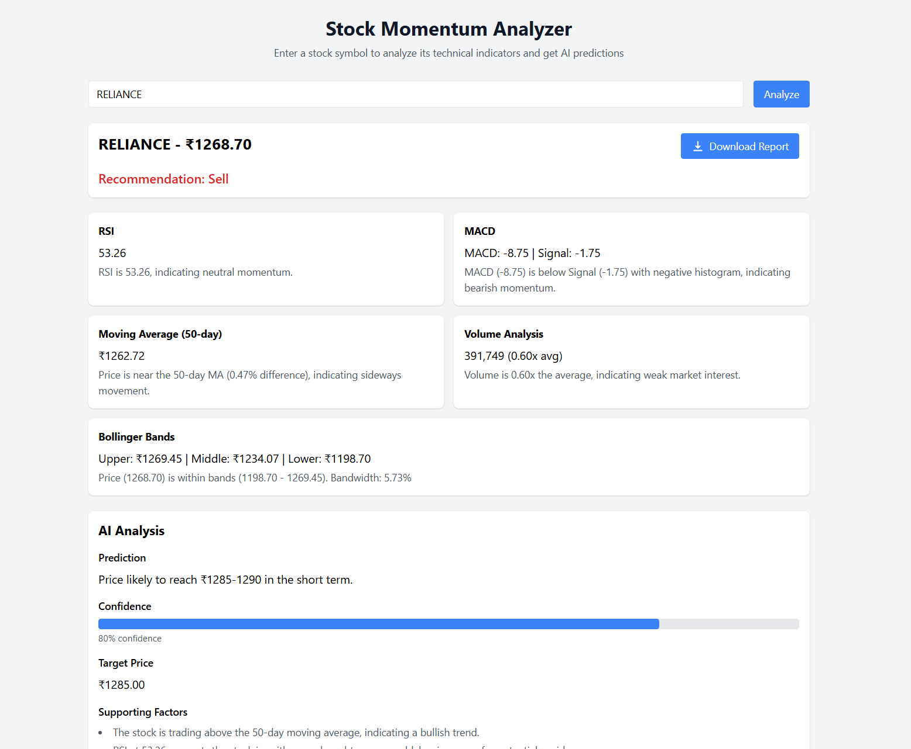

# Stock Momentum Analyzer

A professional stock analysis tool that combines technical indicators with AI-powered predictions to provide comprehensive analysis for Indian stocks. Generate detailed PDF reports to make informed investment decisions.

## 📊 Demo



## ✨ Features

### 📈 Technical Analysis

- **RSI (Relative Strength Index)**

  - Momentum indicator measuring speed and magnitude of price movements
  - Overbought/Oversold identification
  - Range: 0-100 (30/70 thresholds)
- **MACD (Moving Average Convergence Divergence)**

  - Trend-following momentum indicator
  - Signal line crossovers
  - Histogram analysis
- **Moving Averages**

  - 50-day moving average for trend identification
  - Price crossovers analysis
  - Trend strength measurement
- **Volume Analysis**

  - Volume trend comparison
  - Average volume calculation
  - Volume-price relationship
- **Bollinger Bands**

  - Dynamic volatility bands
  - Standard deviation based
  - Mean reversion signals

### 🤖 AI-Powered Analysis

- Real-time market sentiment analysis
- Pattern recognition
- Trend prediction with confidence scores
- Risk factor identification
- Supporting evidence compilation

### 📑 Professional PDF Reports

- Comprehensive technical analysis
- Clean, professional layout
- Visual representations
- Detailed AI insights
- Easy-to-read format

## 🛠️ Technology Stack

### Backend Architecture

```
server/
├── src/
│   ├── config/         # Configuration files
│   ├── controllers/    # Request handlers
│   ├── services/       # Business logic
│   ├── middleware/     # Custom middleware
│   └── types/          # TypeScript types
```

### Frontend Structure

```
client/
├── src/
│   ├── components/     # React components
│   ├── services/       # API integration
│   ├── types/         # TypeScript interfaces
│   └── utils/         # Helper functions
```

## 📝 API Documentation

### Stock Analysis Endpoint

\`\`\`http
GET /api/stock/:symbol
\`\`\`

#### Parameters

| Parameter  | Type       | Description                                       |
| :--------- | :--------- | :------------------------------------------------ |
| \`symbol\` | \`string\` | **Required**. Stock symbol (e.g., RELIANCE) |

#### Response

```
interface AnalysisResult {
  recommendation: "Buy" | "Sell" | "Hold";
  stockData: {
    symbol: string;
    currentPrice: number;
    rsi: number;
    movingAverage50: number;
    volume: number;
    averageVolume: number;
    macd: number;
    signalLine: number;
    bollingerBands: {
      upper: number;
      middle: number;
      lower: number;
    };
  };
  analysis: {
    rsiAnalysis: string;
    maAnalysis: string;
    volumeAnalysis: string;
    macdAnalysis: string;
    bollingerAnalysis: string;
    aiPrediction?: {
      prediction: string;
      confidence: number;
      supportingFactors: string[];
      risks: string[];
      shortTermTarget: number | null;
    };
  };
}
```

#### Example Response

```
{
  "recommendation": "Buy",
  "stockData": {
    "symbol": "RELIANCE",
    "currentPrice": 2450.75,
    "rsi": 65.32,
    "movingAverage50": 2380.45,
    // ... other data
  },
  "analysis": {
    "rsiAnalysis": "RSI indicates strong momentum...",
    // ... other analysis
  }
}
```

## 🚀 Installation

1. **Clone the repository**

   ```
   git clone https://github.com/milindkusahu/AI-Stock-Momentum.git
   cd AI-Stock-Momentum
   ```
2. **Backend Setup**

   ```
   cd server
   npm install
   cp .env.example .env  # Create and configure environment variables
   npm run dev
   ```
3. **Frontend Setup**

   ```
   cd client
   npm install
   npm run dev
   ```

### Environment Variables

```
env
```

# Server Configuration

PORT=5000
NODE_ENV=development

# API Keys

ALPHA_VANTAGE_API_KEY=your_api_key_here
OPENAI_API_KEY=your_api_key_here

# Rate Limiting

RATE_LIMIT_WINDOW=60000
RATE_LIMIT_MAX_REQUESTS=5

## 📈 Technical Indicator Details

### RSI (Relative Strength Index)

- Calculation period: 14 days
- Overbought threshold: 70
- Oversold threshold: 30
- Signal generation:
  ```typescript
  getRSISignal(rsi: number): Signal {
    if (rsi > 70) return 'Sell';
    if (rsi < 30) return 'Buy';
    return 'Neutral';
  }
  ```

### MACD

- Fast EMA: 12 periods
- Slow EMA: 26 periods
- Signal Line: 9-period EMA of MACD
- Implementation:
  ```typescript
  calculateMACD(prices: number[]): MACDResult {
    const fastEMA = calculateEMA(prices, 12);
    const slowEMA = calculateEMA(prices, 26);
    const macd = fastEMA - slowEMA;
    const signal = calculateEMA([...Array(prices.length - 26).fill(0), macd], 9);
    return { macd, signal, histogram: macd - signal };
  }
  ```

## 🔒 Rate Limiting

Rate limiting is implemented using a token bucket algorithm:

```typescript
interface RateLimit {
  count: number;
  resetTime: number;
}

const WINDOW_MS = 60 * 1000;  // 1 minute
const MAX_REQUESTS = 5;       // 5 requests per window
```

## 🤝 Contributing

1. Fork the repository
2. Create your feature branch (\`git checkout -b feature/AmazingFeature\`)
3. Commit your changes (\`git commit -m 'Add some AmazingFeature'\`)
4. Push to the branch (\`git push origin feature/AmazingFeature\`)
5. Open a Pull Request

## 📄 License

This project is licensed under the MIT License - see the [LICENSE](LICENSE) file for details.

## ⚠️ Disclaimer

This tool is for informational purposes only. The technical analysis and AI predictions provided should not be considered as financial advice. Always conduct thorough research and consult with qualified financial advisors before making investment decisions.

## 🙏 Acknowledgments

- [Alpha Vantage](https://www.alphavantage.co/) for stock market data
- [OpenAI](https://openai.com/) for AI capabilities
- All contributors and supporters of this project
